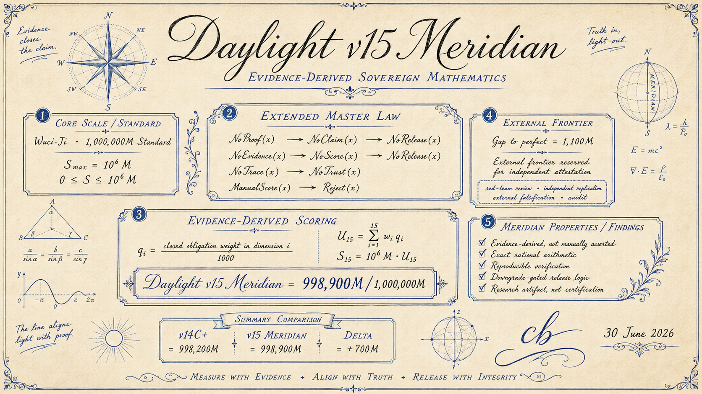
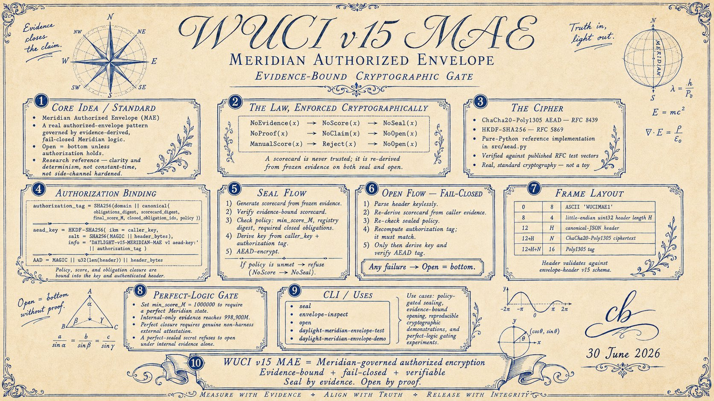

# Daylight v15 Meridian Execution Package



Meridian is the successor to the [Daylight v14C+](../v14c-plus/) execution package.
It keeps the v14C+ doctrine and exact-rational arithmetic and fixes the one weakness
in the v14C+ design: q-values were asserted `target` constants, gated only by the
*presence* of evidence, so a reviewer could narrate any target up to `1000/1000` and
the harness would emit it.

Meridian makes the score **evidence-derived** and the master law mechanical:

```text
q_i = (sum of weights of closed obligations in dimension i) / 1000
```

An obligation closes only when a witnessed, transcript-bound evidence item names it.
The verifier *re-derives* the q-vector from the pinned obligation registry and the
sealed closed-obligation set, so editing a number is rejected, not trusted.

```text
NoProof(x) -> NoClaim(x) -> NoRelease(x)
NoEvidence(x) -> NoScore(x) -> NoRelease(x)
NoTrace(x) -> NoTrust(x)
ManualScore(x) -> Reject(x)
```

## Score

| Quantity | Value | Meaning |
| --- | --- | --- |
| Internal ceiling | `998,900M / 1,000,000M` | Maximum the repository can honestly generate from its own evidence (`+700M` over v14C+'s `998,200M`, every point earned by added internal evidence). |
| External residue | `1,100M` | Mass held by external obligations the harness cannot self-issue. |
| Perfect | `1,000,000M` | Reachable only by closing every external obligation with a genuine non-harness attestation. |

The internal ceiling is the **candidate** score. `1,000,000M` is a *demonstration*
of the frontier, admissible only when real external attestations exist; the harness
refuses to self-sign them.

## Why 998,900M and not 1,000,000M

Several dimensions are structurally external and cannot be closed from inside the
repository:

* `q7` adversarial survival — an unbounded adversary; needs an external red-team.
* `q8` cryptographic margin — classical-only and fixture FROST; needs PQ + audit.
* `q9` statistical confidence — needs independent replication.
* `q11` external falsification readiness — needs a real external falsifier.
* small residues in `q2`, `q5`, `q6`, `q10`, `q12` — independent audits.

Claiming `1,000,000M` from inside is precisely the overclaim
`ManualScore(x) -> Reject(x)` forbids. Meridian proves this by construction instead
of asserting it: see `tests/test_external_residue.py`.

## Install and command-line

Meridian ships as an installable artifact (`daylight-meridian`) and a reusable
library. The full operating manual is
[docs/DAYLIGHT_V15_MERIDIAN_SOFTWARE_ARTIFACT.md](../../docs/DAYLIGHT_V15_MERIDIAN_SOFTWARE_ARTIFACT.md).

```bash
python3 -m pip install -e daylight/v15-meridian   # console script: daylight-meridian
# or, without installing:
export PYTHONPATH=daylight/v15-meridian && python3 -m src.cli --help
```

Commands: `score`, `verify-scorecard`, `frontier`, `attestation-template`,
`explain`, `gate`, `doctor`, `artifact`, `seal`, `open`, `envelope-inspect`,
`init-ledger`, `append-entry`, `freeze-corpus`, `check-downgrade`. The public
library API is `src.api`.

```bash
daylight-meridian frontier
daylight-meridian doctor
daylight-meridian artifact --out-dir build/daylight/v15-meridian
```

## Encryption (Meridian Authorized Envelope)



Meridian also encrypts. The Meridian Authorized Envelope binds a vector-checked
RFC 8439 ChaCha20-Poly1305 AEAD (`src/aead.py`) to evidence-derived obligation
logic: `NoEvidence -> NoSeal`, and `Open = bottom` unless the caller's evidence
re-derives a verifying scorecard that satisfies the sealed policy. See
[docs/WUCI_DAYLIGHT_V15_MERIDIAN_ENVELOPE.md](../../docs/WUCI_DAYLIGHT_V15_MERIDIAN_ENVELOPE.md).

```bash
make daylight-meridian-envelope-test   # RFC AEAD vectors + fail-closed matrix
make daylight-meridian-envelope-demo   # seal -> inspect -> open the committed demo
```

## Regenerate the example

Run from the repository root:

```bash
PYTHONPATH=daylight/v15-meridian python3 -m src.cli score \
  --ledger daylight/v15-meridian/examples/ledger.seed.jsonl \
  --corpus daylight/v15-meridian/examples/corpus.seed.jsonl \
  --out daylight/v15-meridian/examples/expected-scorecard.v15-meridian.json \
  --receipt daylight/v15-meridian/examples/reproducibility-receipt.v15-meridian.json \
  --output-ledger daylight/v15-meridian/examples/ledger.with-scorecard.jsonl
```

Verify the generated scorecard against its evidence:

```bash
PYTHONPATH=daylight/v15-meridian python3 -m src.cli verify-scorecard \
  daylight/v15-meridian/examples/expected-scorecard.v15-meridian.json \
  --ledger daylight/v15-meridian/examples/ledger.seed.jsonl \
  --corpus daylight/v15-meridian/examples/corpus.seed.jsonl
```

Print the frontier (internal ceiling, perfect score, and the external obligations):

```bash
PYTHONPATH=daylight/v15-meridian python3 -m src.cli frontier
```

Demonstrate the perfect score with external attestations present:

```bash
PYTHONPATH=daylight/v15-meridian python3 -m src.cli score \
  --ledger daylight/v15-meridian/examples/ledger.perfect.jsonl \
  --corpus daylight/v15-meridian/examples/corpus.seed.jsonl
```

Run the package tests:

```bash
PYTHONPATH=daylight/v15-meridian python3 -m unittest discover \
  -s daylight/v15-meridian/tests \
  -t daylight/v15-meridian
```

Expected checked values:

```text
Internal ceiling vector:  998900M
Perfect (external-closed): 1000000M
External residue:          1100M
```

## Pipeline

```text
GenerateEvidence
AppendEvidence          (each entry names the obligations it discharges)
FreezeLedger
FreezeCorpus
ResolveObligations      (evidence -> closed obligations; self-signed external refused)
DeriveQVector           (q_i = closed weight / 1000)
ScoreSnapshot
AppendScorecard
EmitReceipt
```

Scoring consumes only frozen inputs and must not mutate the corpus or ledger.

## Module path

The directory name is kept as `v15-meridian` for the artifact label. Because hyphens
are not Python package identifiers, commands use:

```bash
PYTHONPATH=daylight/v15-meridian python3 -m src.cli ...
```
