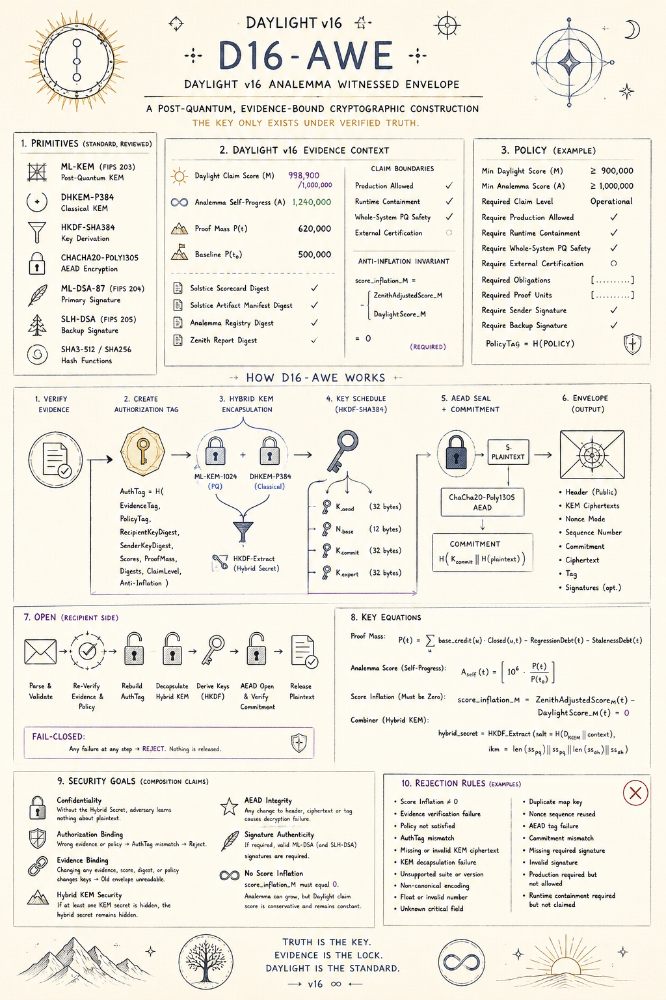

# Daylight v16 Analemma Witnessed Envelope

This directory records the draft Daylight v16 Analemma Witnessed Envelope
construction:



```text
D16-AWE =
  HybridKEM(ML-KEM-1024, DHKEM-P384)
  + HKDF-SHA384 evidence-bound key schedule
  + ChaCha20-Poly1305 AEAD
  + optional ML-DSA/SLH-DSA sender signatures
  + fail-closed Daylight v16 evidence authorization
```

It is a specification package, not an executable cryptographic implementation.
Do not add placeholder ML-KEM, ML-DSA, SLH-DSA, or verifier stubs here. A future
implementation must use real pinned primitives and must keep all current WUCI
claim boundaries:

- not a new lattice primitive
- not a new AEAD primitive
- not FIPS-validated
- not production-ready until reviewed
- not a runtime sandbox
- not whole-system post-quantum security by default

The closest current implementation substrate is the Rust
`daylight-equation/rust/daylight-crypto` lane, which already uses pinned AEAD,
ML-KEM, ML-DSA, SLH-DSA, DHKEM(P-384), and Argon2id dependencies for local
research evidence. The v15 Meridian Python envelope remains a reference
authorization demo and should not be promoted into v16 production cryptography.

## Files

- `specs/daylight-v16-awe.md` - normative draft with the repo-specific fixes
  needed before implementation.
- `src/` - executable mechanics for canonicalization, policy-aware evidence,
  authorization tags, HKDF-SHA384 schedule, commitments, and a vector-only AEAD
  envelope lane over externally supplied KEM material.
- `tests/` - deterministic positive and fail-closed negative tests.

## Implementation Gate

Before this directory grows executable code, require:

1. A real, pinned crypto backend profile.
2. Deterministic vectors for positive and negative cases.
3. A policy-aware Daylight v16 evidence verifier.
4. QCAGE digest-vector and no-false-PQ-claim checks.
5. HARDEN safe-I/O and no-partial-plaintext release tests.
6. External review before any production-readiness claim.

Run the current executable slice:

```sh
PYTHONPATH=daylight/v16-analemma-crypto python3 -m unittest discover \
  -s daylight/v16-analemma-crypto/tests \
  -t daylight/v16-analemma-crypto
```
