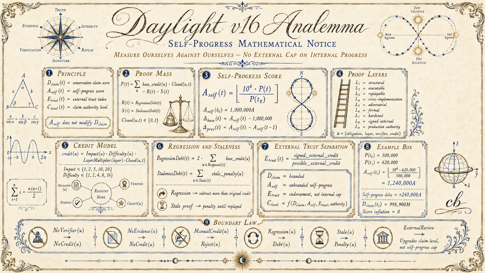

# Daylight v16 Analemma

Daylight v16 Analemma is a self-progress scoring layer over the v15+ Solstice
artifact. It does not alter the conservative Daylight claim score.

```text
D_claim = conservative Solstice claim score
A_self  = self-relative proof-mass score
E_trust = external attestation/trust index
C_level = claim authority level
```

The current repository-owned Solstice artifact remains:

```text
D_claim_M = 998900 / 1000000
A_self_A  = 1000000A
E_trust_M = 0 / 1000000
C_level   = C1_replayable_public_artifact
```

The designed next-score example is intentionally separate from the current
claim:

```text
P(t0) = 500000
P(t1) = 620000
A_self(t1) = floor(1000000 * 620000 / 500000) = 1240000A
```

That score is claimable only after the registry actually contains, and verifiers
actually close, `120000` additional proof credits over the `500000`-credit
baseline. The current implemented baseline remains `1000000A`.

Analemma measures verified proof mass against a pinned baseline:

```text
AnalemmaScore_A(t) = floor(1,000,000 * ProofMass(t) / ProofMass(t0))
ProofMass(t) = ClosedCredit(t) - RegressionDebt(t) - StalenessDebt(t)
```

The proof-unit registry is [rules/proof-units.v1.json](rules/proof-units.v1.json).
Each unit has pinned impact, difficulty, layer, verifier, and integer
`base_credit`. Manual credit, float values, and claim-score overrides are
rejected.



## Commands

```sh
make daylight-analemma-ci
make daylight-analemma-report
make daylight-analemma-verify
```

Direct CLI:

```sh
PYTHONPATH=daylight/v16-analemma python3 -m src.cli verify-artifact build/daylight/v15-solstice
PYTHONPATH=daylight/v16-analemma python3 -m src.cli report build/daylight/v15-solstice --out-dir build/daylight/v16-analemma
PYTHONPATH=daylight/v16-analemma python3 -m src.cli verify-report build/daylight/v16-analemma
```

## Boundary

Analemma can exceed `1,000,000A` when new proof mass is verified, but that is not
score inflation:

```text
score_inflation_M = 0
D_claim_M remains governed by Solstice/Zenith claim rules
external review upgrades claim level, not internal self-progress eligibility
production authority remains a separate gate
```

Public phrasing:

```text
Daylight remains 998,900M on conservative claim closure.
Analemma measures self-progress at 1,240,000A only after the proof mass is verified.
The number did not inflate; the proof mass grew.
```
