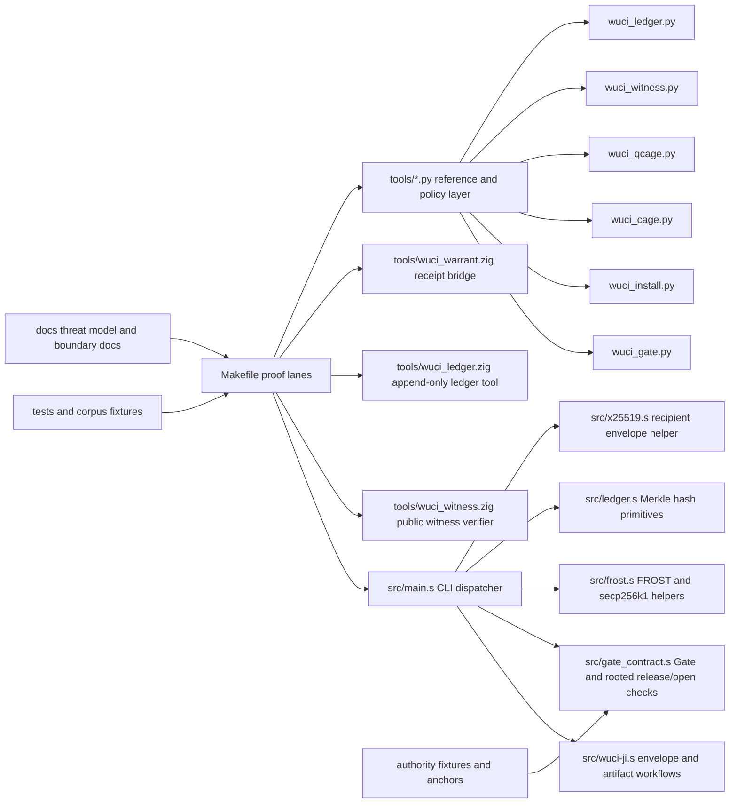

# Deep Research Report on `chasebryan/-wuci-ji`

## Executive Summary

`-wuci-ji` is a research-grade x86_64 artifact machine centered on handwritten assembly, with Python and Zig used as orchestration and portable verifier layers. The repository explicitly describes itself as a **research/proof artifact**, **not production cryptography**, **not a runtime sandbox**, **not post-quantum secure**, and **not independently audited**. Its current strongest claim is mechanical proof composition: it can build a Linux x86_64 binary, seal it, derive manifests and warrant messages, verify flat and rooted Gate contracts, produce witness bundles, append those bundles into a Merkle ledger, and audit a signed local install. The repo currently has **118 commits**, **0 open issues**, **0 pull requests**, **0 stars**, and **0 forks** visible on GitHub. citeturn41view0turn31view0turn16view0

The codebase is materially substantial rather than toy-sized. The largest assembly module, `src/wuci-ji.s`, is **5,472 lines / 124 KB**; `src/gate_contract.s` is **2,337 lines / 59.9 KB**; `src/frost.s` is **1,628 lines / 41.6 KB**; `src/x25519.s` is **1,031 lines / 18.6 KB**; the main Python test harness `tests/test_wuci_ji.py` is **940 lines / 34.4 KB**; and the Zig witness/ledger bridges are also sizable at **946 lines / 36.2 KB** and **1,163 lines / 41.1 KB**, respectively. GitHub’s language breakdown shows the repository is **Python-heavy overall by bytes** despite its trust boundary narrative being assembly-first: **Python 53.9%**, **Assembly 31.7%**, **Zig 9.5%**, **Makefile 4.9%**. citeturn35view0turn35view1turn35view3turn35view4turn21view0turn38view0turn39view0turn29view0

Architecturally, the repository is coherent and unusually well-documented about what is and is not enforced. The narrowest claimed enforcement boundary belongs to assembly: envelope parsing/open, manifests, warrant messages, flat Gate contracts, rooted open/release checks, and ledger hash primitives. Zig owns the current “portable public verifier bridge” for witness and ledger operations, while Python remains the reference/policy/install/orchestration layer. This separation is a real strength because the repository’s documentation consistently distinguishes “enforced implementation boundary” from “policy/test claim.” citeturn30view0turn31view0turn29view2turn42view4

The main risks are exactly the ones the repository itself acknowledges. The codebase relies on custom unaudited crypto and custom assembly, does not claim production FROST authority, does not claim PQ verification, does not provide OS sandboxing, and does not yet have native coverage-guided fuzzing in CI. The full native `make test` path also requires Linux x86_64 plus BMI2 and AVX for the current X25519 helper, which materially narrows portability and contributor friendliness. citeturn31view0turn27view0turn43view0

The most important near-term work is not “add more cryptographic surface.” It is to **tighten operational reliability around what already exists**: eliminate documentation/CI drift, formalize build prerequisites, split and harden the test surface, add machine-readable CLI outputs for Gate/install/ledger/witness flows, and introduce a first native fuzz lane for envelope/Gate/authority/ledger parsers. Medium-term work should focus on stabilizing a user-consumable verifier interface and reducing reliance on monolithic files. Long-term work should focus on evidence-backed hardening only after ergonomics and CI depth improve. Those priorities follow directly from the repository’s current maturity statement, threat model, security boundary, and fuzzing/release documents. citeturn41view0turn31view0turn30view0turn43view0turn43view1

## Repository Overview

The repository’s declared purpose is to explore “a small x86_64 assembly artifact machine” that can **seal artifacts**, **derive manifests and warrant messages**, **enforce flat Gate contracts**, **anchor release/open decisions to fixture roots**, **build public witness bundles**, and **commit those bundles into a Merkle ledger**. The README is admirably explicit that the current FROST authority is deterministic fixture material for tests and proofs rather than a production signing authority. citeturn41view0

At the top level, the repository is organized into `.github/workflows`, `.grok/skills/wuci-ji`, `authority`, `docs`, `include`, `install`, `src`, `tests`, and `tools`, plus `.gitignore`, `AGENTS.md`, `BUILD_NOTES.md`, `LICENSE`, `Makefile`, and `README.md`. The structure is consistent with the project’s trust split: assembly in `src`, policy/reference/verifier tools in `tools`, fixtures and corpora in `tests`, authority anchors in `authority`, and process/boundary specifications in `docs`. The `tests/corpus` tree currently includes at least `armor`, `authority-root`, `envelope`, `gate-contract`, and `ledger-entry` corpora. citeturn41view0turn28view0turn26view0

A practical “size map” of the codebase is below. GitHub’s surfaced metadata does not expose one canonical whole-repository byte total in the pages inspected, so the most reliable primary-source size view is by major file/module. citeturn35view0turn35view1turn35view2turn35view3turn35view4turn21view0turn36view0turn36view1turn36view2turn36view3turn36view4turn37view0turn38view0turn38view1turn39view0

| Area | File | Size indicator |
|---|---|---|
| Core assembly | `src/wuci-ji.s` | 5,472 lines / 124 KB citeturn35view0 |
| Gate boundary | `src/gate_contract.s` | 2,337 lines / 59.9 KB citeturn35view1 |
| FROST assembly | `src/frost.s` | 1,628 lines / 41.6 KB citeturn35view3 |
| X25519 assembly | `src/x25519.s` | 1,031 lines / 18.6 KB citeturn35view4 |
| Ledger hash core | `src/ledger.s` | 158 lines / 3.21 KB citeturn35view2 |
| Main test harness | `tests/test_wuci_ji.py` | 940 lines / 34.4 KB citeturn21view0 |
| Installer | `tools/wuci_install.py` | 815 lines / 30.2 KB citeturn36view1 |
| Ledger reference tool | `tools/wuci_ledger.py` | 907 lines / 33.1 KB citeturn36view2 |
| Quantum evidence tool | `tools/wuci_qcage.py` | 851 lines / 34.6 KB citeturn36view0 |
| Witness reference tool | `tools/wuci_witness.py` | 721 lines / 25.5 KB citeturn37view0 |
| Witness verifier bridge | `tools/wuci_witness.zig` | 946 lines / 36.2 KB citeturn38view0 |
| Ledger verifier bridge | `tools/wuci_ledger.zig` | 1,163 lines / 41.1 KB citeturn39view0 |
| Warrant verifier bridge | `tools/wuci_warrant.zig` | 610 lines / 22.5 KB citeturn38view1 |
| Gate preview tool | `tools/wuci_gate.py` | 268 lines / 7.89 KB citeturn36view4 |
| CAGE airlock tool | `tools/wuci_cage.py` | 469 lines / 17.1 KB citeturn36view3 |

The primary execution surface lives in the assembly CLI dispatcher. `src/main.s` exposes a large command table that includes hashing, envelope operations, FROST helpers, secp256k1 scalar/field/point primitives, Gate verification/open/release operations, ledger hash primitives, manifest/inspect helpers, armor/dearmor, AEAD helpers, selftest, and assembly regression. That command table matters operationally because it shows the project is already functioning as a broad CLI machine, not just a library of isolated routines. citeturn12view0turn13view0turn14view0turn15view0

A concise functional map of the repository looks like this:



That diagram is an inference from the repository tree, the README functional descriptions, and the explicit trust-boundary split documented in `THREAT_MODEL.md` and `SECURITY_BOUNDARY.md`. citeturn41view0turn31view0turn30view0turn26view0

## Build, Run, and Verification

The project’s documented native contract is clear: `src/wuci-ji.s` is an **x86_64 Linux program** that defines `_start` directly and uses Linux syscall numbers. Native build and execution therefore require **x86_64 Linux**, **GNU-style `as` and `ld`**, and **Python 3** for the harness. On non-Linux hosts, the documented route is Zig-based cross-build rather than native execution. citeturn20view0turn41view0

The shortest documented build/test sequences are:

```sh
# Native Linux x86_64
make clean
make test

# Non-Linux host with Zig installed
make clean
make build-linux
file build/wuci-ji-linux-x86_64

# Linux host using user-mode QEMU
make clean
make test-linux
# or
make test-linux QEMU_X86_64=/path/to/qemu-x86_64
```

Those are the project’s own documented commands, taken from `BUILD_NOTES.md` and the README. citeturn20view0turn41view0

There is a very important hardware/runtime nuance: the full native `make test` lane currently requires **BMI2 and AVX**, because the current assembly X25519 helper depends on those CPU features. On systems lacking those features, the project recommends `make test-linux` under user-mode `qemu-x86_64`, defaulting to `QEMU_CPU=Haswell-v4`. That is not a minor note; it is the main reason a contributor may experience “works on CI / fails locally” or vice versa. citeturn27view0turn41view0

The repository also documents binary/runner override hooks in the Python harness, which is useful for experimentation and for Codex-driven local validation:

```sh
WUCI_JI_BIN=/path/to/wuci-ji \
WUCI_JI_RUNNER=qemu-x86_64 \
python3 tests/test_wuci_ji.py
```

Leaving `WUCI_JI_RUNNER` unset is the documented path for native Linux execution. citeturn20view0

For installation and install-audit flows, there is an additional operational dependency: OpenSSH’s `ssh-keygen`. `wuci_install.py` expects a local copied install root key, validates it against the repository sidecar hash, requires the key to be an **OpenSSH Ed25519 public key**, and can fail if `ssh-keygen` is absent or not given as an absolute path when overridden. The documented install workflow begins by copying `install/wuci-install-root.v1.pub` into `~/.config/wuci-ji/install-root.pub`. citeturn24view4turn24view2turn42view5

A practical build/run matrix is below.

| Scenario | Recommended command path | Required tools | Notes |
|---|---|---|---|
| Native dev on Linux x86_64 | `make test` | GNU `as`, GNU `ld`, Python 3 | Also needs BMI2 + AVX for full native X25519 coverage. citeturn20view0turn27view0turn41view0 |
| Older Linux CPU or constrained host | `make test-linux` | Zig, Python 3, `qemu-x86_64` | Default QEMU CPU is `Haswell-v4`. citeturn20view0turn27view0 |
| macOS or other non-Linux host | `make build-linux` | Zig | Produces Linux ELF; docs do not promise native macOS execution. citeturn20view0turn41view0 |
| Install/audit flow | `make install-proof` then `~/.local/bin/wuci-ji-audit` | `ssh-keygen`, copied install root key | Installer is zero-prompt and signed-manifest oriented. citeturn42view5turn24view4turn24view2 |

The repository already maintains an unusually rich proof-lane catalog in `docs/BUILD_TARGETS.md`, including native proof lanes, Zig proof lanes, witness/archive tests, ledger tests, HARDEN/CAGE/QCAGE proof targets, and “high attestation” lanes. That documentation is a strength, but it also creates an expectation that the build pipeline should surface which lanes are essential versus aspirational. As written, the docs are thorough for a maintainer but still somewhat dense for a first-time contributor. citeturn27view0

The main “missing steps” or documentation gaps are operational rather than conceptual. The project does **not** currently document package-manager installation commands for binutils, Zig, QEMU, Python, or OpenSSH on common hosts; it does not pin minimum supported Zig/binutils/Python versions in the README; it does not provide a one-command bootstrap script for contributors; and it does not present a short compatibility matrix for “native Linux / Linux+QEMU / macOS cross-build / Windows unsupported or TBD.” Those are not source omissions in the cryptographic logic, but they are real onboarding friction points. This conclusion is an inference from the current README/Build Notes content and the absence of dependency manifests or bootstrap docs in the surfaced top-level tree. citeturn41view0turn20view0

One especially notable gap is **documentation/CI drift**. `BUILD_NOTES.md` states that `.github/workflows/ci.yml` runs the native Linux x86_64 suite and then the native/Zig publish and witness proof lanes, but the checked-in `ci.yml` content surfaced here shows a much narrower workflow centered on checkout, toolchain display, and a single `make clean && make test` step. That mismatch is itself a high-priority maintenance issue because it weakens trust in the repo’s operational status reporting. citeturn20view0turn8view0

## Architecture, Dependencies, and Code Quality

### Architectural responsibilities

The project’s own threat-model and security-boundary documentation are unusually explicit about component boundaries. Assembly is documented as enforcing the envelope secrecy boundary, flat Gate contract boundary, rooted authority boundary, and ledger hash primitives; Zig is described as the portable witness/ledger/contract verifier bridge; Python remains the reference/policy/install/CAGE/QCAGE orchestration layer; and the Makefile composes proof lanes rather than acting as a cryptographic primitive. citeturn30view0turn31view0

At the command surface, `src/main.s` acts as a dispatcher over a broad set of externally implemented handlers, including manifest/warrant helpers, Gate verification/open/release commands, ledger commands, envelope operations, and many developer/test cryptographic primitives. This makes `main.s` the CLI routing choke point and the most obvious place for any future command-surface stabilization effort such as machine-readable help, exit-code normalization, or command grouping. citeturn13view0turn14view0turn15view0

Within the Python and Zig layers, the module responsibilities are reasonably clear from the repository layout and README:

- `wuci_gate.py` is a preview Gate CLI that verifies a WUCI-WARRANT receipt before allowing a controlled no-overwrite open; it exposes `check` and `open` subcommands and integrates verifier identity strictness and reserved-action policy. citeturn25view2turn36view4
- `wuci_install.py` is a zero-prompt signed installer with `trust-key-check`, `manifest`, `verify-manifest`, `install`, and `audit` subcommands, and it uses OpenSSH detached signatures plus local copied root-key validation. citeturn24view1turn24view2turn24view4turn36view1
- `wuci_cage.py` is an “artifact airlock” that validates public witness bundles, emits deterministic CAGE attestations, rejects private/demo material, and explicitly denies general runtime execution claims in v1. citeturn42view0turn23view0turn23view1turn36view3
- `wuci_qcage.py` extends CAGE with quantum-aware metadata and policy, but it explicitly fails closed for `hybrid-required` and `pq-required` modes because v1 has **no real PQ verifier**. citeturn42view1turn23view3turn23view2turn36view0
- `wuci_ledger.zig` is the active append-only ledger lane for init/append/inclusion/consistency/history operations; `wuci_ledger.py` remains the regression/reference harness. citeturn42view4turn23view5turn23view6turn36view2turn39view0
- `wuci_witness.zig` is the active witness verifier bridge for public bundle verification and deterministic archive handling. citeturn42view3turn38view0

### Dependency analysis

The dependency profile is intentionally lean in the Python layer. The surfaced Python modules use mostly standard-library imports (`argparse`, `hashlib`, `json`, `os`, `sys`, `pathlib`, typing helpers) plus local project modules such as `wuci_witness` and `wuci_verifier_identity`. No `requirements.txt`, `pyproject.toml`, `poetry.lock`, or similar Python dependency manifest is visible in the top-level tree surfaced here. That suggests low third-party Python supply-chain risk, at the cost of concentrating more logic inside the repository itself. citeturn23view0turn25view3turn41view0

The real dependencies are toolchain and platform dependencies:

| Dependency | Role | Risk assessment |
|---|---|---|
| GNU `as` / `ld` | Native assembly build | Critical dependency; Linux-x86_64-specific build path. citeturn20view0turn41view0 |
| Python 3 | Test harness and policy/reference tooling | Low ecosystem risk, but large operational surface because tests and installer depend on it. citeturn20view0turn31view0 |
| Zig | Cross-build and active witness/ledger bridge | Medium maintenance risk because it is both a build bridge and part of the active verifier lane. citeturn20view0turn29view2turn42view4 |
| `qemu-x86_64` | Cross-run testing on non-native or older-feature Linux hosts | Medium contributor-friction risk; essential when BMI2/AVX are unavailable. citeturn20view0turn27view0 |
| `ssh-keygen` | Install manifest verification | Low complexity, but install-path hard dependency. citeturn24view2turn24view4 |

The most significant security and maintenance risk is not third-party dependency sprawl; it is **custom unaudited implementation concentration**. The trust model places “highest implementation trust” in handwritten assembly that includes custom crypto primitives, envelope handling, Gate/root checks, and ledger hash core, while the threat model explicitly says the project is not independently audited, not formally verified, and does not have broad fuzzing or constant-time certification. citeturn31view0turn30view0

### Code quality assessment

On style and intent clarity, the repository is strong. Naming is consistent across “WUCI-*” conceptual layers, docs are unusually explicit about scope and non-goals, and the security boundary is documented in terms of “enforced today” versus “not enforced today.” This is a rare strength: it reduces the chance that readers confuse research evidence with production guarantees. citeturn31view0turn30view0

On test coverage, the repository is materially better than average for low-level research code. There is a substantial Python harness (`tests/test_wuci_ji.py`), a corpus tree for adversarial inputs, assembly smoke/regression targets, dedicated Gate/ledger/witness proof targets, malformed-envelope coverage in the build notes, and explicit parser/adversarial test lanes in the fuzzing plan. That said, the repo’s own fuzzing document states that there is **not yet a native coverage-guided fuzzer in CI**, and the threat model explicitly says there is no broad fuzzing or formal verification today. citeturn21view0turn28view0turn27view0turn43view0turn31view0turn20view0

On CI, the current visible GitHub Actions workflow is narrow compared with the repo’s documented proof matrix. The workflow shown here runs on Ubuntu, checks out code, prints basic toolchain information, and runs `make clean && make test`. That is useful, but it is not yet a strong public signal for a project whose README and build docs advertise many distinct proof lanes, including install, witness, publish, ledger, HARDEN, CAGE, QCAGE, and Zig-specific paths. citeturn8view0turn27view0turn20view0

On documentation, the project is strong on **boundary prose** and weaker on **consumer ergonomics**. It has dedicated documents for threat model, security boundary, build targets, release process, and fuzzing plan, and the README is detailed. However, there is no surfaced short “contributor bootstrap” guide, no high-level architectural map for new readers, no command grouping/reference page generated from the assembly dispatcher, and no crisp compatibility matrix for supported host/toolchain combinations. That is a documentation quality issue, not because docs are scarce, but because the existing docs are optimized for a maintainer who already understands the vocabulary. citeturn41view0turn27view0turn31view0turn30view0turn43view0turn43view1

### Open issues and commit history highlights

As currently visible on GitHub, the repository shows **0 issues**, **0 pull requests**, and **0 forks/stars**. That does not mean the codebase is inactive—quite the opposite—but it does mean there is no external issue backlog visible to guide prioritization, and there is limited outside signal about user pain points. citeturn16view0turn41view0

The latest visible commit page shows an intense burst of work on **June 20, 2026**, focused on extending the secp256k1/FROST surface and tightening release/witness/install flows: field arithmetic, affine and Jacobian point operations, projective scalar-loop hardening, FROST transcript hashes, round-one commitments, binding aggregation, challenge helper, signing-share scalar, signature aggregation, verification, artifact metadata commands, v2 sealed envelope/file seal variants, keyfile-backed workflows, crypto temporary scrubbing, X25519 recipient envelopes, witness/publish artifacts, and Darwin cross-build handoff restoration are all present in the visible recent history. That visible pattern strongly suggests recent development has prioritized expanding and proving the cryptographic/proof machinery rather than operational packaging. citeturn16view0turn17view3

A representative recent-history reading is:

| Theme in visible recent commits | Example commit titles |
|---|---|
| FROST/secp256k1 surface expansion | “Add FROST secp256k1 scalar backbone,” “Add FROST secp256k1 round-one commitments,” “Add FROST secp256k1 challenge helper,” “Add FROST secp256k1 signing-share scalar,” “Add FROST secp256k1 signature aggregation,” “Add FROST secp256k1 verification.” citeturn16view0turn17view3 |
| ECC implementation growth | “Add secp256k1 field arithmetic,” “Add secp256k1 affine point operations,” “Add secp256k1 Jacobian projective operations,” “Harden secp256k1 projective scalar loop.” citeturn16view0turn17view3 |
| Artifact/witness/publish improvements | “Add envelope inspect command,” “Add envelope manifest command,” “Add keyfile-backed file workflows,” “Add manifest artifact fingerprints,” “Add manifest ciphertext fingerprints,” “Add ASCII armor file workflow.” citeturn17view3 |
| Hardening and hygiene | “Enforce exact CLI argument counts,” “Scrub crypto temporaries,” “Scrub global crypto buffers on exit,” “Restore Darwin cross-build handoff.” citeturn17view3 |

This visible history is a positive sign for technical momentum, but it also reinforces the case for stabilizing what already exists before enlarging the low-level surface yet again. That conclusion is my inference from the recent commit clustering, the current threat model, and the outstanding CI/fuzzing limits. citeturn17view3turn31view0turn43view0

## Risk, Security, Privacy, and Licensing

The repository’s own posture is conservative, and that is good. It explicitly states that it is **not production crypto**, **not a runtime sandbox**, **not post-quantum secure**, and **not independently audited**. The threat model further says that production FROST authority, runtime containment, PQ verification, independent audit, formal verification, broad fuzzing, and constant-time certification are **not enforced today**. If this project is ever used outside research/proof contexts, those disclaimers should be treated as load-bearing rather than legal boilerplate. citeturn31view0turn41view0

The most important security nuance in the current boundary is the difference between **artifact authorization** and **runtime containment**. The CAGE and QCAGE layers are explicitly described as artifact-airlock and quantum-aware evidence layers, not OS sandboxing. CAGE v1 denies general runtime execution claims until runtime sandbox enforcement exists, and QCAGE v1 refuses to claim PQ safety without real PQ verification. That honesty lowers the risk of accidental overclaiming, but it also means the project should resist any future temptation to market these layers as operational sandboxing or post-quantum assurance prematurely. citeturn42view0turn42view1turn23view3

There is also a privacy-relevant implementation nuance in the artifact open path. The security boundary document says plain `open-file*` and Gate-authorized opens use streaming authenticated decryption with a sibling `0600` temp file and only commit the final output path after tag/Gate success. That is better than writing unauthenticated plaintext to the requested path, but the document is also explicit that a transient private plaintext temp file exists before final commit. For local proof tooling this may be acceptable; for hardened production claims it would need more careful threat treatment. citeturn30view0

From a maintenance-risk perspective, the highest-priority concerns are these:

| Risk | Why it matters | Evidence basis |
|---|---|---|
| Custom unaudited assembly crypto | Highest-trust boundary is handwritten and explicitly not audited or formally verified. | citeturn31view0turn30view0 |
| CI narrower than documented proof surface | Reduces confidence that advertised lanes stay healthy. | citeturn8view0turn20view0turn27view0 |
| No native coverage-guided fuzzing in CI | Parser-heavy low-level code benefits disproportionately from fuzzing. | citeturn43view0turn31view0 |
| Platform specialization | Linux x86_64, GNU toolchain, BMI2/AVX requirements narrow contributor base. | citeturn20view0turn27view0turn41view0 |
| Single visible maintainer concentration | Latest visible commits are all authored/committed by Chase Bryan, increasing bus-factor risk. | citeturn16view0turn17view3 |
| No visible issue backlog | Makes prioritization less transparent and reduces external signal. | citeturn16view0turn41view0 |

On licensing, the repository is under **Apache License 2.0**. The license text grants copyright rights and an explicit patent license, and requires preservation of license/notice conditions for redistribution. Apache’s own license page identifies the SPDX identifier as `Apache-2.0`, and the Apache Foundation states that Apache-2.0 is compatible with **GPLv3** but not considered compatible with **GPLv2-only**. citeturn20view1turn34search4turn34search3turn34search21

That yields a practical compatibility note for future extension work:

- Adding MIT/BSD/ISC-style code is usually straightforward in Apache-2.0 projects, subject to attribution preservation.
- Combining Apache-2.0 code into GPLv3 distributions is generally acceptable, but the resulting combined work must respect GPLv3.
- GPLv2-only code is the main compatibility trap and should be avoided unless relicensed or dual-licensed appropriately.
- If future contributors add third-party code or generated SBOM content, they should preserve Apache notice obligations and keep provenance artifacts aligned with the release-process document’s expectations. citeturn20view1turn34search3turn34search4turn43view1

## Roadmap, Extensibility, and Codex-Ready Tasks

The estimates below are my inference from the current repository shape, module sizes, documented proof-lane breadth, current CI narrowness, and the project’s declared non-goals. They are not commitments from the repository itself. citeturn35view0turn35view1turn36view0turn36view1turn39view0turn27view0turn31view0turn8view0

### Recommended milestones

| Milestone | Goal | Estimated total effort | Risk |
|---|---|---:|---|
| Milestone Alpha | Remove doc/CI drift, formalize prerequisites, split tests, improve contributor bootstrap docs | 14–24 hours | Low |
| Milestone Beta | Add machine-readable CLI outputs, stabilize verifier-facing interfaces, improve integration coverage | 24–40 hours | Medium |
| Milestone Gamma | Introduce native fuzzing lane, tighten boundary audits, prepare release-quality evidence packaging | 40–80 hours | High |

### Prioritized actionable recommendations

| Priority | Recommendation | Why now | Effort | Risk |
|---|---|---|---:|---|
| P0 | Make CI match documented proof lanes, or narrow the docs to match reality | Current docs and current CI appear inconsistent. This is a credibility problem. | 4–8h | Low |
| P0 | Add `docs/CONTRIBUTOR_BOOTSTRAP.md` with package installs, tool versions, and supported-host matrix | The project already documents concepts well but not setup ergonomics. | 3–6h | Low |
| P1 | Split `tests/test_wuci_ji.py` into thematic suites with markers | One 940-line harness is workable, but hard to navigate and selectively run. | 6–10h | Low |
| P1 | Add machine-readable `--json` outputs to installer, Gate, witness, and ledger CLIs | This will make automation and Codex workflows dramatically easier. | 10–18h | Medium |
| P1 | Add a generated command reference from the `src/main.s` command table | The assembly CLI surface is now wide enough to merit generated docs. | 6–12h | Medium |
| P2 | Introduce first native fuzz target set for envelope/Gate/authority/ledger parsers | The repo’s own fuzzing plan says this is missing. | 16–32h | High |
| P2 | Refactor monolithic modules by boundary, especially `src/wuci-ji.s` | Improves reviewability and future safety work. | 16–40h | High |
| P2 | Add release-verification script that checks all evidence in `docs/RELEASE_PROCESS.md` | The docs are strong; packaging the checks into one command would raise operability. | 8–16h | Medium |
| P3 | Design a stable verifier-facing API layer | Needed if others will consume witness/ledger/Gate functions programmatically. | 20–40h | Medium |
| P3 | Explore audited third-party verifier interop or formal spec extraction | Appropriate only after Milestones Alpha and Beta stabilize the surface. | 40h+ | High |

### Concrete extensibility points

The best extension points are **not** the lowest-level crypto internals; they are the “bridge” layers that already have clear responsibilities and low blast radius.

#### Machine-readable verifier outputs

A high-value extension is to add structured JSON outputs to tools that are now human-oriented. The best initial candidates are:

- `tools/wuci_gate.py`
- `tools/wuci_install.py`
- `tools/wuci_ledger.zig`
- `tools/wuci_witness.zig`

This recommendation follows from the current subcommand-heavy CLIs and the project’s proof-lane orientation. citeturn25view2turn24view1turn42view4turn42view3

Example API shape to add:

```json
{
  "schema": "wuci-gate-check-v1",
  "artifact": "build/demo/sealed.wj",
  "action": "open",
  "decision": "allow",
  "strict_mode": true,
  "receipt_sha256": "…",
  "contract_sha256": "…",
  "authority_root_sha256": "…",
  "warnings": []
}
```

A Python implementation sketch for `wuci_gate.py`:

```python
def emit_json(result: dict) -> int:
    import json
    import sys
    json.dump(result, sys.stdout, sort_keys=True)
    sys.stdout.write("\n")
    return 0
```

That snippet is a proposed addition, not existing repository code.

#### Thin Python programmatic wrapper

The project already has strong CLI semantics. A safe intermediate API is therefore a **thin wrapper** around the stable CLI rather than direct binding to assembly internals.

```python
from __future__ import annotations

import json
import subprocess
from pathlib import Path

class WuciGateClient:
    def __init__(self, bin_path: str = "python3", script: str = "tools/wuci_gate.py") -> None:
        self.bin_path = bin_path
        self.script = script

    def check(self, artifact: Path, action: str, receipt: Path) -> dict:
        proc = subprocess.run(
            [
                self.bin_path,
                self.script,
                "check",
                "--artifact", str(artifact),
                "--action", action,
                "--receipt", str(receipt),
                "--json",
            ],
            capture_output=True,
            text=True,
            check=True,
        )
        return json.loads(proc.stdout)
```

That wrapper would become much cleaner if the CLI exposed `--json`, which is why those two recommendations reinforce each other.

#### Generated command reference from assembly dispatcher

Because `src/main.s` already contains the canonical command table and usage strings, a script can parse the `.asciz "command-name"` entries and usage message text to generate a `docs/COMMANDS.md` page. That would reduce doc drift and make the assembly CLI feel less opaque. citeturn14view0turn15view0

#### Release-bundle verifier

The release process document enumerates required evidence for any real release: source commit, clean-tree provenance, SBOM/provenance artifacts, digests, host/toolchain versions, witness bundle, ledger evidence, install manifest/signature, install-root fingerprint, and warning text. That list is strong enough to justify a dedicated `tools/verify_release_bundle.py` or `make verify-release-bundle` target. citeturn43view1

Suggested responsibilities for that verifier:

```text
1. Validate presence and naming of all release artifacts.
2. Recompute SHA-256/SHA-384/SHA-512 for release binary.
3. Verify install manifest detached signature via ssh-keygen.
4. Verify witness bundle contents and attestation.
5. Verify ledger inclusion and consistency proofs.
6. Confirm README warning text is present in release notes.
7. Emit one machine-readable pass/fail summary.
```

### Codex-ready prompts

OpenAI’s official Codex CLI docs say Codex runs locally in the terminal, can read/change/run code in the selected directory, and is started with the `codex` command. In practice, the safest workflow here is to start an interactive Codex session in the repository root and paste one prompt at a time. citeturn44search0

#### Short-term prompts

```text
You are working in the -wuci-ji repository.

Task:
1. Inspect .github/workflows/ci.yml, README.md, BUILD_NOTES.md, and docs/BUILD_TARGETS.md.
2. Identify every place where the documented CI/proof lanes differ from the actual workflow.
3. Produce a patch that does one of the following:
   - either expands ci.yml to match the documented minimum supported proof lanes,
   - or narrows/clarifies the docs so they exactly match the current workflow.
4. Add a short docs/CI_SCOPE.md file that names:
   - what CI guarantees,
   - what it does not guarantee,
   - which proof lanes are local-only.
5. Run the narrowest available validation commands and summarize the result.
Constraints:
- Do not add speculative guarantees.
- Preserve the repo’s existing “research/proof artifact” language.
```

```text
You are working in the -wuci-ji repository.

Task:
Split tests/test_wuci_ji.py into smaller thematic test modules without changing behavior.

Desired structure:
- tests/test_cli_core.py
- tests/test_envelope.py
- tests/test_gate.py
- tests/test_witness.py
- tests/test_ledger.py
- tests/test_install.py
- tests/test_frost_and_secp256k1.py

Requirements:
- Keep existing helper behavior intact.
- Preserve WUCI_JI_BIN and WUCI_JI_RUNNER override support.
- Add pytest markers or consistent naming so subsets can be run easily.
- Update Makefile or docs if test entrypoints change.
- Provide a migration summary.
```

```text
You are working in the -wuci-ji repository.

Task:
Create docs/CONTRIBUTOR_BOOTSTRAP.md.

Include:
- required host/platform assumptions,
- required tools per workflow (GNU as/ld, Python 3, Zig, qemu-x86_64, ssh-keygen),
- native Linux path,
- Linux+QEMU path,
- non-Linux Zig cross-build path,
- install/audit path,
- common failure modes,
- a concise compatibility matrix.

Use only claims already supported by existing repo docs and code comments. Do not introduce production claims.
```

#### Medium-term prompts

```text
You are working in the -wuci-ji repository.

Task:
Add machine-readable --json output to tools/wuci_gate.py and tools/wuci_install.py.

Requirements:
- Keep default human-oriented output unchanged unless --json is passed.
- Define stable schema strings:
  - wuci-gate-check-v1
  - wuci-gate-open-v1
  - wuci-install-manifest-v1
  - wuci-install-audit-v1
- Emit deterministic key ordering.
- Add negative tests.
- Document the schemas in docs/API_SURFACES.md.
```

```text
You are working in the -wuci-ji repository.

Task:
Generate a docs/COMMANDS.md reference from src/main.s so the command list cannot drift from the assembly dispatcher.

Requirements:
- Parse the command table and usage strings from src/main.s.
- Group commands by functional area.
- Mark commands as:
  - stable verifier surface,
  - artifact workflow,
  - dev/test crypto primitive,
  - explicitly risky public-only primitive.
- Cross-reference docs/THREAT_MODEL.md and docs/SECURITY_BOUNDARY.md.
```

```text
You are working in the -wuci-ji repository.

Task:
Add a release bundle verifier.

Deliverables:
- tools/verify_release_bundle.py
- make verify-release-bundle
- docs/RELEASE_BUNDLE.md

Checks should include:
- required files from docs/RELEASE_PROCESS.md,
- digest recomputation,
- install manifest signature verification,
- witness bundle verification,
- ledger proof verification,
- machine-readable JSON summary output.

Do not claim production readiness; preserve existing warning language.
```

#### Long-term prompts

```text
You are working in the -wuci-ji repository.

Task:
Introduce an initial native fuzzing lane for parser-heavy boundaries.

Target surfaces:
- envelope header/version/length parsing,
- gate contract parser,
- authority root parser,
- ledger entry/head/proof parser,
- armor/dearmor parser.

Requirements:
- Reuse tests/corpus as seed corpora where possible.
- Keep crashing inputs replayable from make test.
- Document toolchain assumptions and why the lane is opt-in or CI-enabled.
- Add a short security note explaining current limitations.
```

```text
You are working in the -wuci-ji repository.

Task:
Refactor src/wuci-ji.s into smaller boundary-oriented assembly modules without changing the public command surface.

Suggested split:
- envelope_open.s
- envelope_seal.s
- manifest_and_inspect.s
- warrant_message.s
- aead_helpers.s
- cli_handlers.s

Requirements:
- Preserve command names and output formats.
- Update assembly include/link order carefully.
- Run all affected proof lanes.
- Produce a review note listing behavioral invariants preserved.
```

### Sample test templates

The repository already supports overriding the binary and runner with `WUCI_JI_BIN` and `WUCI_JI_RUNNER`, so new tests should keep that pattern. citeturn20view0

A sample unit-style CLI test template:

```python
from __future__ import annotations

import os
import subprocess
from pathlib import Path


def run_wuci(args: list[str], stdin: bytes | None = None) -> subprocess.CompletedProcess:
    bin_path = os.environ.get("WUCI_JI_BIN", "build/wuci-ji")
    runner = os.environ.get("WUCI_JI_RUNNER")
    cmd = [bin_path, *args] if not runner else [runner, bin_path, *args]
    return subprocess.run(cmd, input=stdin, capture_output=True, check=False)


def test_help_works() -> None:
    proc = run_wuci(["--help"])
    assert proc.returncode == 0
    assert b"usage: wuci-ji" in proc.stdout


def test_unknown_command_fails_closed() -> None:
    proc = run_wuci(["definitely-not-a-command"])
    assert proc.returncode != 0
    assert b"usage: wuci-ji" in proc.stderr
```

A sample integration-style Gate test template:

```python
from __future__ import annotations

import json
import subprocess
from pathlib import Path


def run_py(*args: str) -> subprocess.CompletedProcess:
    return subprocess.run(["python3", *args], capture_output=True, text=True, check=False)


def test_gate_check_json_schema(tmp_path: Path) -> None:
    artifact = Path("build/wuci-gate-demo/sealed.wj")
    receipt = Path("build/wuci-gate-demo/auth-receipt.json")

    proc = run_py(
        "tools/wuci_gate.py",
        "check",
        "--artifact", str(artifact),
        "--action", "open",
        "--receipt", str(receipt),
        "--json",
    )
    assert proc.returncode == 0, proc.stderr
    data = json.loads(proc.stdout)
    assert data["schema"] == "wuci-gate-check-v1"
    assert data["action"] == "open"
    assert data["decision"] in {"allow", "deny"}
```

A sample corpus-replay test template aligned with the fuzzing plan:

```python
from __future__ import annotations

from pathlib import Path
import subprocess


CORPUS_DIR = Path("tests/corpus/gate-contract")


def test_gate_contract_corpus_replays_fail_closed() -> None:
    for sample in CORPUS_DIR.iterdir():
        if not sample.is_file():
            continue
        proc = subprocess.run(
            ["build/wuci-ji", "gate-contract-verify", "build/demo/sealed.wj", str(sample)],
            capture_output=True,
            text=True,
            check=False,
        )
        assert proc.returncode != 0 or "verified" in proc.stdout.lower()
```

### Sample CI upgrade snippet

The current visible CI is `make clean && make test`, while the documentation describes a broader proof surface. A reasonable next-step CI shape is a layered workflow rather than one giant job. This snippet is a proposed improvement, not current repository code. Its structure is motivated by the existing build-target docs and release/witness lanes. citeturn8view0turn27view0turn20view0turn43view1

```yaml
name: ci

on:
  push:
    branches: [main]
  pull_request:
    branches: [main]

jobs:
  native:
    runs-on: ubuntu-latest
    steps:
      - uses: actions/checkout@v4
      - name: Show toolchain
        run: |
          uname -a
          python3 --version
          as --version | head -n 1
          ld --version | head -n 1
      - name: Native test
        run: make clean && make test

  zig:
    runs-on: ubuntu-latest
    steps:
      - uses: actions/checkout@v4
      - name: Install Zig
        uses: mlugg/setup-zig@v2
      - name: Cross-build and Zig proof lanes
        run: |
          make clean
          make build-linux
          make witness-zig
          make witness-zig-test

  proof-lanes:
    runs-on: ubuntu-latest
    needs: [native, zig]
    steps:
      - uses: actions/checkout@v4
      - name: Proof lanes
        run: |
          make authority-root-check
          make gate-contract-asm
          make self-release-witness-bundle
          make self-release-ledger-bundle
```

### Feature comparison table

| Candidate feature | Primary benefit | Best implementation layer | Estimated effort | Priority |
|---|---|---|---:|---|
| `--json` outputs for Gate/install/ledger/witness | Automation, scripting, Codex-friendly consumption | Python first, then Zig | 10–18h | High |
| Generated command reference from `src/main.s` | Prevent doc drift, improve discoverability | Python script or small parser tool | 6–12h | High |
| CI/doc drift repair | Raises trust in public project status | Docs + GitHub Actions | 4–8h | Highest |
| Split Python tests into modules | Faster debugging and selective runs | Python tests | 6–10h | High |
| Native fuzz lane | Better parser hardening | C/assembly harness or external fuzz toolchain | 16–32h | Medium-high |
| Release bundle verifier | Better release evidence integrity | Python or Zig | 8–16h | Medium |
| Stable programmatic Python wrapper | Easier downstream use | Python | 8–14h | Medium |
| Assembly module decomposition | Better reviewability and future safety work | Assembly | 16–40h | Medium-high |

### Practical recommendation ordering

If you only do five things next, they should be these, in this order:

1. **Repair CI vs docs drift.**
2. **Add contributor bootstrap docs and a host/toolchain compatibility matrix.**
3. **Split the main test harness and make targeted runs easy.**
4. **Add `--json` output to the main bridge tools.**
5. **Introduce the first native fuzz lane.**

That sequence respects the repo’s self-description. The project already has ambitious proof machinery; what it most needs now is tighter operational truthfulness, ergonomics, and fail-closed validation around the boundary it already claims. citeturn31view0turn30view0turn27view0turn43view0turn8view0turn20view0