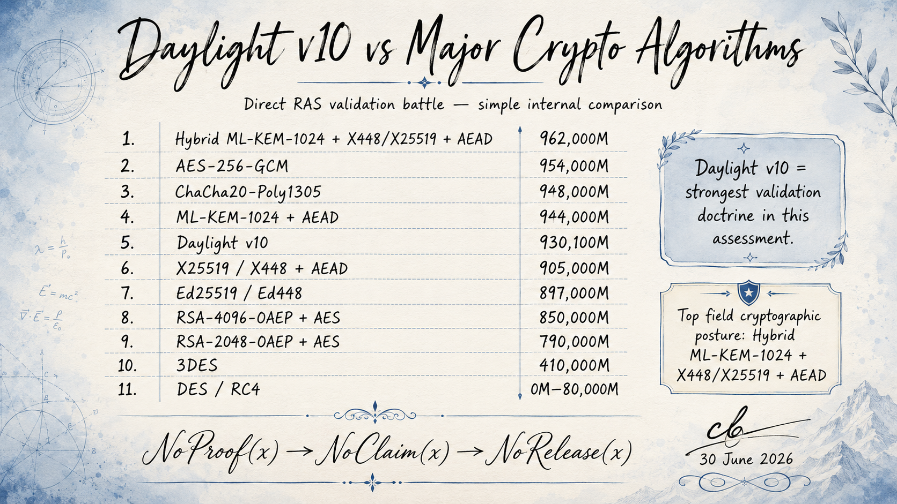

# Daylight v10

> [!IMPORTANT]
> WuciOS-Fluff-Audit: historical-non-authoritative
> This file is retained as a legacy Wuci-OS/Daylight fixture for existing tools
> and tests. It is not WuciOS v2.4 release evidence, not a current score source,
> and not part of Noether Core.

## Minimal Verified Release Kernel for Wuci-Ji



Daylight v10 compresses v9 into an executable release kernel.

```text
Daylight v8  = mathematical cryptographic substrate
Daylight v9  = proof-carrying subtractive operating substrate
Daylight v10 = minimal verified release kernel
              + standard crypto profile
              + attack-surface closure calculus
              + conservative evidence utility
```

Core principle:

```text
Daylight != new cipher

Daylight =
  cryptographic wiring
  + release authority
  + evidence calculus
  + proof kernel
```

The cryptographic primitives must come from standard audited profiles. Daylight
controls how those primitives are bound to canonical manifests, Merkle roots,
claims, witness bundles, ledgers, boot traces, and release gates.

## Top Equation

```text
Publish_D10(ISO)=1
  IFF
    I!_D10(ISO)
    AND ProofKernel_D10(ISO)=1
    AND CryptoProfileOK_D10=1
    AND SheafGlue_D10=1
    AND BootBisim_D10=1
    AND LedgerFresh_D10=1
    AND SurfaceClosed_D10=1

Publish_D10(ISO)=0
  IFF NOT(Publish_D10(ISO)=1)
```

No partial score, confidence score, or aesthetic score can compensate for a
failed release-kernel predicate.

## 1. Initializer Bang

The `!` mark is a real admission operator:

```text
I!_D10(x) :=
  C14N(x)
  AND SchemaOK(x)
  AND ProfileBound(x)
  AND RootBound(x)
  AND LedgerBound(x)
  AND Fresh(x)
  AND NoPrivateLeak(x)
```

No object enters Daylight until it is canonicalized, schema-valid,
crypto-profile-bound, Merkle-root-bound, ledger-bound, fresh, and public-safe.

Symbolic public-context tags are allowed only as tags:

```text
I!_{@ctuniversity -> @NSAgov,D10}(x)
  :=
    I!_D10(x)
    AND Tag(x,@ctuniversity)
    AND Tag(x,@NSAgov)
    AND PublicContextOnly(x)
```

Those tags do not imply endorsement, authorization, or external review unless
real signed evidence exists.

## 2. Seven Layers

```text
D10 = <C,K,F,G,L,B,A>

C = canonicalization
K = standard crypto profile
F = evidence sheaf
G = meet-semilattice gate kernel
L = fresh append-only ledger
B = build/boot bisimulation
A = attack-surface closure
```

V10 is a layered verification machine, not a broad manifesto.

## 3. Standard Crypto Profile

```text
CryptoProfile_D10 =
  <KEM,SIG,AEAD,KDF,HASH,DRBG,KeyLifecycle,Revocation>

CryptoProfileOK_D10 =
  Allowed(KEM)
  AND Allowed(SIG)
  AND Allowed(AEAD)
  AND Allowed(KDF)
  AND Allowed(HASH)
  AND KeyLifecycleOK
```

Post-quantum readiness is profile-bound. A profile may include standardized
PQC primitives such as ML-KEM, ML-DSA, or SLH-DSA, but Daylight must not claim
quantum safety from classical-only evidence.

Key lifecycle:

```text
KeyValid_D(k,t)
  IFF
    Generated_D(k)
    AND t in UsageWindow(k)
    AND NOT Revoked_D(k,t)
    AND NOT Compromised_D(k,t)

Decrypt_D(x,k,t)=1
  =>
    KeyValid_D(k,t)
    AND CryptoProfileOK_D
    AND LedgerFresh_D(x,t)
```

## 4. Proof Kernel

The release kernel is intentionally small:

```text
ProofKernel_D10(S) =
  SourceOK(S)
  AND PackageOK(S)
  AND RootFSOK(S)
  AND ManifestOK(S)
  AND SealOK(S)
  AND BootOK(S)
  AND LedgerOK(S)
  AND ClaimsOK(S)
  AND SurfaceOK(S)

EXISTS i: g_i(S)=0 => ProofKernel_D10(S)=0

ProofKernel_D10(S)=1 IFF FORALL i: g_i(S)=1
```

This is boolean proof-gating. Scores are diagnostics only.

## 5. Attack-Surface Closure Calculus

```text
SurfaceRaw_D(S) = {a_1,...,a_n}

ClosureProofs_D(S) = {pi_1,...,pi_m}

Closed_D(S) =
  {a_i | EXISTS pi_j: Verify_D(pi_j,a_i)=1}

OpenSurface_D(S) = SurfaceRaw_D(S) \ Closed_D(S)

Publish_D(S)=1 => OpenSurface_D(S)=empty
```

Example closure mapping:

| Raw surface | Required v10 closure proof |
| --- | --- |
| Stale manifest replay | ledger freshness proof |
| ISO drift | final manifest digest proof |
| Dependency gap | package fixed-point proof |
| Boot spoof | QEMU/hardware trace bisimulation |
| Claim inflation | proof-carrying claim root |
| Fixture authority promotion | production authority ceremony proof |
| Private material leak | public/private noninterference proof |
| Score masking | meet-semilattice gate proof |

## 6. Freshness

```text
Fresh_D(x,t)
  IFF
    t_nbf(x) <= t <= t_exp(x)
    AND epoch(x)=epoch_D(t)
    AND NOT Revoked_D(x,t)

LedgerFresh_D(x,t)
  IFF
    Included_D(x,L_t)
    AND Fresh_D(x,t)
    AND L_t = Head_D

Replay_D(x,t)=1
  IFF
    Included_D(x,L_i)
    AND i<t
    AND NOT Fresh_D(x,t)

Replay_D(x,t)=1 => Publish_D(x)=0
```

An artifact may be valid historically but invalid now.

## 7. Boot-Bound Crypto Wire

```text
BootRoot_D =
  H_D(
    "daylight/bootroot/v10"
    || H(T_Q)
    || H(T_H)
    || H(Checkpoints)
    || H(KernelPolicy)
  )

BootBisim_D=1
  IFF
    alpha_D(T_Q)=alpha_D(T_H)
    AND Checkpoints(T_Q)=Checkpoints(T_H)

K_i =
  HKDFExpand(
    K_0,
    "daylight/artifact/v10"
    || artifact_i
    || seq_i
    || root_D
    || BootRoot_D
    || LedgerHead_D,
    n
  )

Decrypt_D(i)=1
  =>
    BootBisim_D=1
    AND LedgerFresh_D=1
    AND AAD_i=current
```

The cryptographic wire opens only under the same boot state the release model
proved.

## 8. Proof-Carrying Claims

```text
Claim_i =
  <statement_i, scope_i, artifact_i, proof_i, surface_i, expiry_i>

ValidClaim_D(i)
  IFF
    Verify_D(proof_i,statement_i,artifact_i)=1
    AND surface_i subseteq Closed_D
    AND Fresh_D(i,t)=1

ClaimsOK_D(S)
  IFF
    FORALL c in Claims(S): ValidClaim_D(c)=1
```

Master law:

```text
Publish_D(x)=1
  =>
    Proof_D(x)=1
    AND Claims_D(x) subseteq Proven_D
    AND Surface_D(x) subseteq Closed_D
    AND Fresh_D(x)=1
```

## 9. Negative Evidence

Failed builds become durable evidence:

```text
NegativeEvidence_i =
  <artifact_i, failure_i, trace_i, environment_i, blocked_claim_i>

Learn_D(E-) =
  Gaps_D union {g | g = blocked_claim(E-)}

E-_i in Ledger_D
  => Claim_D(blocked_i) != Proven
```

The broken ISO is not erased. It becomes a blocker until closed by evidence.

## 10. Conservative Evidence Utility

V10 keeps fail-closed gates primary. Utility scores are bounded diagnostics for
comparing evidence density, residual risk, contradiction pressure, and witness
quality after the proof kernel has already failed or passed.

Scale:

```text
S_max = 10^6 M
0 <= S <= 10^6 M

[x]_0^1 = min(1,max(0,x))
epsilon = 10^-12
```

World object:

```text
W =
  <X,X_0,B,F_t,Omega,Gamma,P,C,R,E,A,mu,omega>

F_0 = id_X
F_{s+t} = F_s o F_t

P = {x in Omega | EXISTS pi: V_Pi(pi,x)=1}

Proof(x)   = 1[x in P]
Claim(x)   = 1[x in C]
Release(x) = 1[x in R]

FORALL x in Omega:
  NOT Proof(x) => NOT Claim(x) => NOT Release(x)

R subseteq C subseteq P
```

Gate:

```text
G =
  1[R subseteq C subseteq P]
  * 1[Gamma not-provable bottom]
  * 1[FORALL e in E: h(e) != bottom AND sigma(e)=1]
```

Quality vector:

```text
q =
  (
    q_Pi,
    q_N,
    q_boundary,
    q_Gamma,
    q_D,
    q_V,
    q_A,
    q_lambda,
    q_H,
    q_K,
    q_S,
    q_R,
    q_Z
  )

w =
  (0.11,0.10,0.08,0.05,0.09,0.07,0.12,0.08,0.08,0.08,0.05,0.04,0.05)
```

The vector measures proof coverage, no-overclaim discipline, boundary
discipline, logical consistency, reachability safety, barrier certificate
pressure, adversarial path probability, hazard rate, min-entropy, key/security
budget, statistical residual risk, reproducibility, and verifier classifier
quality.

Aggregation:

```text
tilde_q_i = max(q_i,epsilon)

GM(q;w) = product_i tilde_q_i^{w_i}

SM_tau(q;w) =
  (sum_i w_i tilde_q_i^tau)^{1/tau}, tau < 0

Xi(q) =
  exp(-sum_{i<j} eta_ij(1-q_i)(1-q_j)), eta_ij >= 0

U(T) =
  G
  * GM(q;w)^(1-rho)
  * SM_tau(q;w)^rho
  * Xi(q)

0 <= U(T) <= 1
```

Conservative score:

```text
U^-_alpha(T) = F^{-1}_{U | E_T}(alpha)

S_{d,alpha}(T) =
  floor_d(10^6 U^-_alpha(T)) M

S_d(T) =
  floor_d(10^6 U(T)) M

984/1000 maps to 984000M
```

Diagnostic-unity condition:

```text
DU_T(W)
  IFF
    G=1
    AND FORALL i: q_i(T)=1
    AND sup_a p_a(T)=0
    AND sup_a integral_0^T lambda_a(t) dt = 0
    AND FORALL t in [0,T]: F_t(X_0) intersect B = empty
    AND H_infty(Y | E_T)=infinity
    AND kappa_NT(T)=infinity
    AND FN=0

DU(W) IFF FORALL T>0: DU_T(W)

S_{d,alpha}(T)=10^6M
  IFF U^-_alpha(T)=1
  IFF DU_T(W)
```

Dominance and evidence density:

```text
S_1 dominates S_0
  IFF FORALL E:
    R_1(E) subseteq R_0(E)
    AND F_1(E) superset F_0(E)
    AND T_1(E) superset T_0(E)
    AND FN_1(E) <= FN_0(E)
    AND U_1(E) <= U_0(E) => EvidenceDensity_1(E) >= EvidenceDensity_0(E)

EvidenceDensity(E,Omega) =
  (1 / |Omega|)
  * SUM_{x in Omega} log(1 + |{e in E : e -> x}|)

S_star =
  argmax_S inf_{T>0} inf_{a in A_T} U_{S,a}(T)
```

The utility layer never grants release:

```text
Publish_D10(x)=0 => S_{d,alpha}(x) is diagnostic-only
ProofKernel_D10(x)=0 => Publish_D10(x)=0
```

## 11. Formal Theorem Stack

```text
Tier 1: Z3
  gate algebra, satisfiability, impossible-release checks

Tier 2: TLA+
  fail-closed state-machine invariants, replay rejection,
  no spontaneous capability

Tier 3: Lean
  Publish implies Proof, Claim, Freshness, and Closed Surface
```

Minimum theorem set:

```text
Theorem_1: NOT BootOK(S) => NOT Publish_D(S)
Theorem_2: C_{t+1} subseteq C_t
Theorem_3: Secret not-> Public
Theorem_4: Replay_D(x,t) => Publish_D(x)=0
Theorem_5: Publish_D(x)=1 => Claims_D(x) subseteq Proven_D
Theorem_6: Publish_D(x)=1 => OpenSurface_D(x)=empty
Theorem_7: Publish_D(x)=1 => LedgerFresh_D(x)=1
```

## 12. Bottom Laws

```text
NoProof_D(x) => NoClaim_D(x) => NoRelease_D(x)

NoFresh_D(x) => NoOpen_D(x) => NoPublish_D(x)

Publish_D(x)=1
  =>
    Proof_D(x)
    AND Fresh_D(x)
    AND Claims_D(x) subseteq Proven_D
    AND Surface_D(x) subseteq Closed_D
```

Final kernel:

```text
Daylight_10 =
  Initializer!
  + StandardCryptoProfile
  + ProofKernel
  + FreshLedger
  + SurfaceClosure
  + BootBoundKeys
  + ConservativeEvidenceUtility
```
