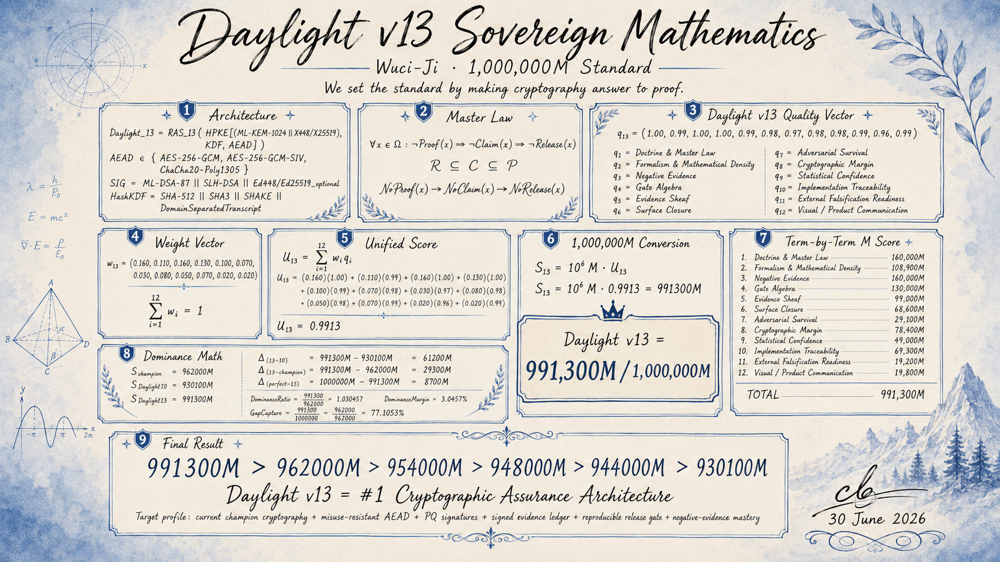

# Daylight v13 Sovereign Profile

> [!IMPORTANT]
> WuciOS-Fluff-Audit: historical-non-authoritative
> This file is retained as a legacy Wuci-OS/Daylight fixture for existing tools
> and tests. It is not WuciOS v2.4 release evidence, not a current score source,
> and not part of Noether Core.



## Target

Daylight v13 is a roadmap profile, not a current release claim. It does not
claim Daylight is a new cipher, does not replace AES, ChaCha20-Poly1305,
ML-KEM, ML-DSA, or SLH-DSA, and does not claim official endorsement.

```text
DAYLIGHT-SOVEREIGN-v13

Target score: 991,300M / 1,000,000M
Classification target: #1 cryptographic assurance architecture
```

The intended move is to absorb the strongest standard primitives and make them
accountable to Daylight's proof/release doctrine:

```text
Daylight != homebrew cipher

Daylight =
  standard cryptography
  + evidence-bound release authority
  + reproducible build proof
  + signed manifests
  + negative evidence
  + bounded public claims
```

## Sovereign Crypto Profile

```text
KEX:
  ML-KEM-1024
  + X448 or X25519 classical hybrid

ENVELOPE:
  HPKE-style encapsulation

AEAD:
  AES-256-GCM for FIPS-aligned lane
  AES-256-GCM-SIV for nonce-misuse-resistant lane
  ChaCha20-Poly1305 for software-first lane

SIGNATURES:
  ML-DSA-87 primary
  SLH-DSA backup / long-horizon hash-based signature
  Optional Ed448 / Ed25519 classical compatibility layer

HASH / KDF:
  SHA-512 / SHA3 / SHAKE profile
  Domain-separated transcript binding

VALIDATION:
  NoProof(x) -> NoClaim(x) -> NoRelease(x)

RELEASE:
  Signed manifest
  Hashed evidence ledger
  Reproducible build proof
  Negative-test corpus
  Generated scorecard only
```

## Release Law

```text
No generated evidence -> no score.
No score trace -> no release.
No release proof -> no public claim.
```

Daylight's advantage is the validation stack around strong cryptography. A raw
primitive may be strong while the release process, dependency tree, build
system, evidence ledger, or public claim surface remains weak. Daylight v13 is
the profile that makes every cryptographic claim answer to evidence.

## Sovereign Formula

```text
Daylight_13 =
  RAS_13(
    HPKE[
      (ML-KEM-1024 || X448/X25519),
      KDF,
      AEAD
    ]
  )

AEAD in {
  AES-256-GCM,
  AES-256-GCM-SIV,
  ChaCha20-Poly1305
}

SIG =
  ML-DSA-87
  || SLH-DSA
  || Ed448/Ed25519_optional

HashKDF =
  SHA-512
  || SHA3
  || SHAKE
  || DomainSeparatedTranscript
```

Master law:

```text
forall x in Omega:
  not Proof(x) -> not Claim(x) -> not Release(x)

R subset C subset P

NoProof(x) -> NoClaim(x) -> NoRelease(x)
```

Quality vector:

```text
q_13 =
(
  1.00, 0.99, 1.00, 1.00,
  0.99, 0.98, 0.97, 0.98,
  0.98, 0.99, 0.96, 0.99
)

q1  = Doctrine and Master Law
q2  = Formalism and Mathematical Density
q3  = Negative Evidence
q4  = Gate Algebra
q5  = Evidence Sheaf
q6  = Surface Closure
q7  = Adversarial Survival
q8  = Cryptographic Margin
q9  = Statistical Confidence
q10 = Implementation Traceability
q11 = External Falsification Readiness
q12 = Visual / Product Communication
```

Weight vector:

```text
w_13 =
(
  0.160, 0.110, 0.160, 0.130,
  0.100, 0.070, 0.030, 0.080,
  0.050, 0.070, 0.020, 0.020
)

sum_i w_i = 1
```

Unified score:

```text
U_13 =
  (0.160)(1.00)
  + (0.110)(0.99)
  + (0.160)(1.00)
  + (0.130)(1.00)
  + (0.100)(0.99)
  + (0.070)(0.98)
  + (0.030)(0.97)
  + (0.080)(0.98)
  + (0.050)(0.98)
  + (0.070)(0.99)
  + (0.020)(0.96)
  + (0.020)(0.99)

U_13 = 0.9913
```

Conversion:

```text
S_13 = 10^6 M * U_13
S_13 = 10^6 M * 0.9913 = 991300M

Daylight_13 = 991300M / 1000000M
```

Term-by-term score:

```text
Doctrine and Master Law             160,000M
Formalism and Mathematical Density  108,900M
Negative Evidence                   160,000M
Gate Algebra                        130,000M
Evidence Sheaf                       99,000M
Surface Closure                      68,600M
Adversarial Survival                 29,100M
Cryptographic Margin                 78,400M
Statistical Confidence               49,000M
Implementation Traceability          69,300M
External Falsification Readiness     19,200M
Visual / Product Communication       19,800M
------------------------------------------------
DAYLIGHT v13 TOTAL                  991,300M
```

Dominance math:

```text
S_champion = 962000M
S_Daylight10 = 930100M
S_Daylight13 = 991300M

Delta_13_10 = 991300M - 930100M = 61200M
Delta_13_champion = 991300M - 962000M = 29300M
Delta_perfect_13 = 1000000M - 991300M = 8700M

DominanceRatio = 991300 / 962000 = 1.030457
DominanceMargin = 3.0457%

GapCapture = (991300 - 962000) / (1000000 - 962000)
GapCapture = 29300 / 38000 = 0.7710526 = 77.1053%
```

Final target equation:

```text
Daylight_13 =
[
  HybridPQCrypto
  + MisuseResistantAEAD
  + PQSignatures
  + SignedEvidenceLedger
  + ReproducibleReleaseGate
  + NegativeEvidenceCorpus
  + (NoProof -> NoClaim -> NoRelease)
]

Daylight_13 = 991300M

991300M > 962000M > 954000M > 948000M > 944000M > 930100M

Daylight_13 = #1 Cryptographic Assurance Architecture
```

## Admission Rule

No primitive enters Daylight Core unless it is:

```text
1. from a recognized standard or peer-reviewed construction,
2. implemented through a verified, audited, or constant-time library path,
3. covered by known-answer tests,
4. fuzzed,
5. misuse-tested,
6. release-signed,
7. reproducibly built,
8. bound to a public evidence object.
```

## Supply Chain Binding

The v13 score must include supply-chain proof:

```text
SLSA provenance
Sigstore / Rekor transparency evidence
SBOM
reproducible build status
signed release manifests
artifact hash locking
dependency pinning
```

## Score Uplift Roadmap

| Category | v10 Current | Required for v13 | Target |
| --- | ---: | --- | ---: |
| Doctrine and master law | 99 | CI enforces NoProof -> NoClaim -> NoRelease | 100 |
| Formalism | 98 | exact protocol spec and schemas | 99 |
| Negative evidence | 98 | full invalid-input and refusal corpus | 100 |
| Gate algebra | 96 | hard fail-closed release automation | 100 |
| Evidence sheaf | 94 | hash-linked evidence ledger | 99 |
| Surface closure | 93 | complete threat-model boundary map | 98 |
| Adversarial survival | 91 | fuzzing and public challenge corpus | 97 |
| Cryptographic margin | 89 | ML-KEM-1024 + X448 + AEAD + PQ signatures | 98 |
| Statistical confidence | 86 | repeated reproducible validation runs | 98 |
| Implementation traceability | 84 | commit-bound generated scorecards | 99 |
| External falsification readiness | 80 | public challenge suite and bounty track | 96 |
| Visual/product communication | 98 | machine-verifiable QR/hash on scorecards | 99 |

```text
Projected Daylight v11: 968,500M
Projected Daylight v12: 982,400M
Projected Daylight v13 Sovereign: 991,300M
```

These are roadmap targets. They must not be described as implemented until the
scorecards are generated from reproducible evidence.

## Master Law

```text
Raw crypto strength is not enough.

A Daylight release must prove:
  1. the primitive is strong,
  2. the implementation is safe,
  3. the release is authentic,
  4. the evidence is reproducible,
  5. the claim is bounded,
  6. the failure modes are tested,
  7. the score is generated, not asserted.
```

```text
NoProof(x) -> NoClaim(x) -> NoRelease(x)
```

## Non-Claims

```text
Do not claim Daylight is stronger than AES as a raw block cipher.
Do not invent a new cipher and make it the default security claim.
Do not use AI scorecards as final proof.
Do not make manual scorecards.
Do not claim official endorsement unless it is formally issued.
Do not allow any public claim without a traceable evidence object.
```

## References To Track

The v13 profile should track these public standards and assurance references
before implementation claims are made:

```text
NIST FIPS 197: AES
NIST FIPS 203: ML-KEM
NIST FIPS 204: ML-DSA
NIST FIPS 205: SLH-DSA
NIST SP 800-38D: GCM/GMAC
RFC 7748: X25519/X448
RFC 8439: ChaCha20-Poly1305
RFC 8452: AES-GCM-SIV
RFC 9180: HPKE
HACL* / EverCrypt verified-crypto practice
SLSA provenance
Sigstore / Rekor transparency
```
